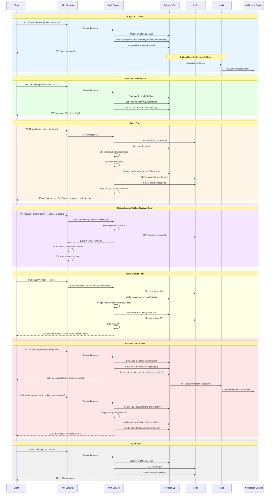

# Auth Service Flow

## Complete Authentication Flow

## Security Features

- **Password Strength**: Minimum 8 characters, requires uppercase, lowercase, number, and special character
- **Rate Limiting**: Redis sliding window (30 req/15min per IP, 10 req/15min per email)
- **Account Lockout**: 5 failed attempts triggers 15-minute lockout
- **Refresh Token Rotation**: New token issued on each refresh, old token invalidated
- **Token Family Tracking**: Reuse of old refresh token revokes entire session family
- **No Email Enumeration**: Forgot-password always returns same response
- **Outbox Pattern**: Guaranteed event delivery via transactional outbox + Kafka relay
